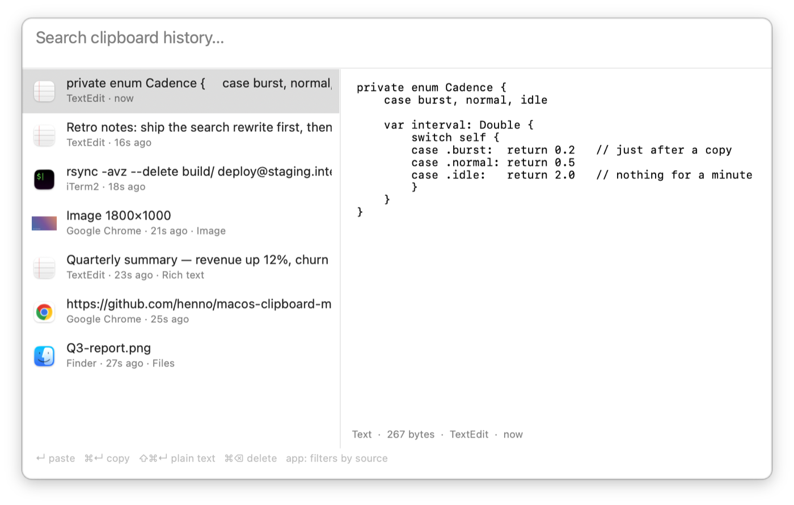

# cbm

A clipboard manager for macOS, built for a small idle CPU cost — that was the
priority, and it shaped most of the decisions below.

Press **⌘⌥C**, type a few characters, press **↵**. The entry goes back on the
clipboard and is pasted into the app you came from.

<picture>
  <source media="(prefers-color-scheme: dark)" srcset="docs/screenshot-dark.png">
  <source media="(prefers-color-scheme: light)" srcset="docs/screenshot-light.png">
  
</picture>

Text, rich text, images and file selections are all captured, with every
pasteboard representation preserved, so pasting is lossless: formatting stays
formatting, and a copied file pastes back into Finder as a file.

## Requirements

- **Deployment target is macOS 14.** Developed and tested only on macOS 26.5,
  Apple Silicon. Earlier versions should work but are unverified.
- **A Swift toolchain.** Command Line Tools are enough — full Xcode is not
  required, and nothing here uses `xcodebuild`. (`xcode-select --install` if
  `swift --version` fails.)
- No third-party dependencies. SQLite comes from the system.

## Quick start

The order matters. Doing step 1 after step 3 means redoing step 3.

**1. Give the build a stable signature.** One time, before granting any
permission:

```bash
make cert
```

This mints a self-signed code-signing certificate, imports it into your login
keychain and marks it trusted for code signing. macOS will ask you to
authenticate once. [Why this is necessary](#why-make-cert-comes-first) — skip it
only if you never intend to use automatic pasting.

**2. Build, install and launch:**

```bash
make run
```

This installs to `~/Applications/cbm.app`. On first launch cbm asks whether to
start at login; you can change that later in Settings.

**3. Allow automatic pasting.** Press ⌘⌥C, pick an entry, press ↵. cbm explains
that it cannot press ⌘V for you and offers to open the right settings pane. Turn
cbm on in **System Settings → Privacy & Security → Accessibility**.

**4. Check it took:**

```bash
make status
```

```
signature       certificate (stable)
accessibility   granted
```

If accessibility still says *not granted*, use **Restart cbm** in cbm's
Settings — and see [Troubleshooting](#troubleshooting).

## Keys

| Key | Action |
|---|---|
| ⌘⌥C | open the panel (press again to close) |
| type | fuzzy search |
| ↑ ↓ | move through results |
| ⌥↑ ⌥↓ | jump eight rows (Page Up/Down do the same) |
| ↵ | paste into the app you came from |
| ⌘↵ | copy to the clipboard only, do not paste |
| ⇧⌘↵ | paste as plain text, discarding formatting |
| ⌘⌫ | delete the selected entry |
| ⌘, | settings |
| esc | close |

⌘A, ⌘C, ⌘X and ⌘V work in the search field as usual.

### Search

Matching is a fuzzy subsequence, ranked: `gthb` finds `github.com`, and matches
at word starts and in consecutive runs rank above scattered ones. Case and
Estonian diacritics are folded, so `arkas` will not find `Ärkas` but `ärkas`
and `ÄRKAS` both will.

Multiple words are separate terms and all of them must match, in any order:
`git commit` matches an entry containing both.

`app:` narrows by source application and combines with terms:

```
app:safari          everything copied from Safari
app:safari github   ...that also matches "github"
```

## Settings

Reachable from the menu bar icon or ⌘, in the panel.

- **Keep at most N entries** (default 1000). The oldest go first.
- **Delete entries older than N days** (default 0, meaning never).
- **Delete images older than N days** (default 30). Images are the expensive
  ones, so they get a shorter life by default.
- **Skip anything larger than N MB** (default 10). Oversized clipboard contents
  are not recorded at all.
- **Launch at login**, **Accessibility status**, storage usage, and live
  measurements.

Limit changes apply to new entries immediately; **Apply limits now** runs the
retention sweep over what is already stored.

## Where your data lives

```
~/Library/Application Support/cbm/
  history.sqlite3   metadata, plus any payload under 64 KiB
  blobs/            larger payloads, keyed by SHA-256 and deduplicated
  thumbs/           256px thumbnails
```

Directories are `0700`, files `0600` — including the SQLite `-wal` sidecar,
which holds recently written content and which SQLite would otherwise create
world-readable.

To delete everything: **Clear history…** in Settings or the menu bar, or

```bash
make uninstall && rm -rf ~/Library/"Application Support"/cbm
```

(`make uninstall` alone removes the app and leaves the history.)

### Privacy

**No encryption.** FileVault already covers the disk, and per-row encryption
would make search unusable while giving nothing against an attacker who can
already read your home directory.

**Nothing leaves the machine.** No network code, no analytics, no sync.

**Password managers are skipped** — with a caveat worth understanding. There is
a convention where an app marks a clipboard write as sensitive with
`org.nspasteboard.ConcealedType` (and similar types); cbm checks for these
before reading anything, so marked content never reaches the history. 1Password
and most managers follow it. **An app that does not follow it will have its
clipboard contents recorded like any other**, so treat this as a good default
rather than a guarantee. If something sensitive does get captured, ⌘⌫ removes it
and its files immediately.

## Accessibility, and why `make cert` comes first

Pressing ⌘V on your behalf needs the Accessibility permission. Everything else
works without it — ↵ still puts the entry on the clipboard, you just press ⌘V
yourself. The panel footer always says which mode you are in.

macOS ties a permission to an app's **code signature**, not to its path. Without
a signing identity, an app is *ad-hoc* signed, meaning its signature is only a
hash of the binary. Every rebuild produces a different hash, so every rebuild
looks like a brand-new app to macOS and silently voids the permission — the
switch in the Accessibility list stays on while doing nothing. This is also why
properly signed apps let you click *Later* rather than *Quit & Reopen*, and an
ad-hoc build does not.

`make cert` fixes this by giving the app a real, stable identity:

```
designated => identifier "ee.henno.cbm" and certificate leaf = H"..."
```

That requirement refers to a certificate rather than a binary hash, so it
survives rebuilds. The certificate is self-signed, local to your machine, and
trusted for code signing only. To undo it: delete `cbm-dev` in Keychain Access
and `rm -rf certs/`.

## Troubleshooting

**Nothing happens on ⌘⌥C.** Another app owns the shortcut — cbm says so at
launch if registration failed. Open the panel from the menu bar icon, or with
`open -a cbm`, which works from Spotlight and other launchers too. To change the
shortcut, edit `HotKeyDefaults` in
[`Sources/cbm/UI/HotKey.swift`](Sources/cbm/UI/HotKey.swift).

**↵ copies but does not paste.** The Accessibility permission is missing or
stale. Run `make status`. If it says `ad-hoc`, run `make cert`, then remove the
old cbm entry from the Accessibility list with **−** before re-adding it — the
stale entry refers to a signature that no longer exists.

**An entry is attributed to the wrong app.** See [Limitations](#limitations).

**The menu bar icon is gone.** cbm is not running. `make run`, or launch it from
`~/Applications`.

## How the idle cost is kept down

`NSPasteboard` has no change notification, so every clipboard manager polls
`changeCount`.

The poll itself is close to free: measured at 0.46 µs per call in a warm loop,
so even 50,000 polls — roughly a day of them — add up to about 0.02 s of CPU.
That figure is a lower bound, since a poll every two seconds runs cold, but the
end-to-end measurement below bounds it from the other side.

So CPU time is not the thing worth optimising here. **Wakeups** are. Waking a
core out of deep idle has a fixed cost no matter how little work follows, and
polling is nothing but a reason to wake up. Everything below exists to reduce
how often that happens, not to make each poll cheaper:

- **Timer leeway.** A `DispatchSourceTimer` with 30 % leeway lets the kernel
  merge our wakeup with wakeups other processes already scheduled, which often
  makes ours effectively free.
- **A cadence derived from the signal we already poll.** Copies arrive in
  bursts: 200 ms for five seconds after a change, 500 ms normally, 2 s once
  nothing has happened for a minute. Deciding this costs no extra API call.
- **Immediate polls on the events that matter** — opening the panel, switching
  apps, waking — so a slow cadence never means stale contents when you look.
- **Fully suspended** while the screen is locked or the machine is asleep.
- **Lazy AppKit.** No window, table view or text system exists until the hotkey
  is pressed for the first time.
- **No vibrancy.** The translucent launcher look makes the window server blur
  everything behind the panel on every frame it is open.
- **Bounded caches.** 8 MB of thumbnails, a 2 MB SQLite page cache, 256-byte
  searchable snippets. Full-size images are read for the preview and the paste,
  never for the list.

Search stays instant through a per-entry character bitmask that rejects most
candidates with a single AND, and through incremental narrowing: a growing query
rescores only the previous result set. That is exact rather than approximate,
because adding a character to a subsequence query can only remove matches, never
add them.

## Measured

On an Apple Silicon Mac, this build:

| | |
|---|---|
| Memory, before the panel is ever opened | **13.4 MB** |
| Memory, after opening the panel once | **~27 MB** |
| CPU while idle | **0.01 s over 120 s — under 0.01 %** |

Memory is `phys_footprint`, the number Activity Monitor shows under Memory. The
`RSS` reported by `ps` is roughly 70 MB, but most of that is framework pages
shared with every other app on the system, which cbm neither owns nor can
shrink.

The CPU figure is a `ps` cputime delta, and 10 ms is that tool's resolution — so
it is really "at most 0.01 s", not a precise reading. It was taken with the
panel already built and the machine otherwise idle. Reproduce it with:

```bash
PID=$(pgrep -x cbm); ps -o time= -p $PID; sleep 120; ps -o time= -p $PID
```

Settings shows all of this live — memory, wakeups per second, clipboard reads
and the last search duration — so the claims here can be checked rather than
believed.

## Development

```bash
make run      # build, install to ~/Applications, relaunch
make test     # run the logic self-tests
make status   # signing state, Accessibility state, data location
make build    # compile only
make stop     # quit a running instance
make cert     # create the stable signing identity (one time)
make uninstall
```

`CONFIG=debug make run` builds unoptimised.

The binary also takes a few arguments directly:

| | |
|---|---|
| `--self-test` | run the logic tests and exit |
| `--status` | print signing and permission state and exit |
| `--show` | open the panel as soon as it launches |
| `--appearance light\|dark` | override the system theme for this process only |

And one environment variable:

| | |
|---|---|
| `CBM_DATA_DIR` | store the history somewhere else |

Together those are how the screenshots above were produced — a throwaway history
in a temporary directory, so nothing real had to be shown or moved, and a
per-process theme override, so taking the light and dark versions did not mean
switching the whole machine's appearance twice:

```bash
CBM_DATA_DIR=/tmp/cbm-demo ~/Applications/cbm.app/Contents/MacOS/cbm \
    --appearance light --show
```

### Source map

| Path | What lives there |
|---|---|
| `Capture/` | pasteboard polling, reading, thumbnailing, source attribution |
| `Store/` | SQLite wrapper, item store, blob store, retention |
| `Search/` | case folding, fuzzy matcher, in-memory index |
| `UI/` | panel, row and preview views, menu bar, settings, hotkey |
| `Paste/` | putting an entry back and synthesising ⌘V |
| `Support/` | settings, paths, metrics, logging, code-signature checks |

### Tests

`make test` runs 41 checks over the parts where a subtle mistake shows up as
"search feels wrong" rather than a crash: byte-preserving case folding, the mask
prefilter, word-boundary detection, match ranking, and the search index —
including a check that incremental narrowing returns exactly what a cold search
returns.

They live in the app binary behind `--self-test` rather than in a test bundle,
because both XCTest and swift-testing ship with Xcode, and this project is built
to need only the Command Line Tools. The cost is a few kilobytes of unreachable
code in the binary. Moving them to a real test target needs a library/executable
split and nothing else.

The AppKit and pasteboard integration — the panel, paste-back, permissions — is
exercised by hand, not automatically.

## Limitations

- **Source attribution is a heuristic.** cbm learns about a clipboard change up
  to one poll interval after it happens, so switching apps within that window
  can attribute an entry to the wrong application.
- **The hotkey is fixed** at ⌘⌥C; changing it means editing the source.
- **The panel is a fixed size** and cannot be resized.
- **Not sandboxed.** App Sandbox would block the global hotkey, Accessibility
  and reading other apps' bundle identifiers.

## Not in this version

Pinned favourites, a per-app ignore list, snippets, sync, and encryption.

## License

[MIT](LICENSE) — © 2026 Henno Täht.
